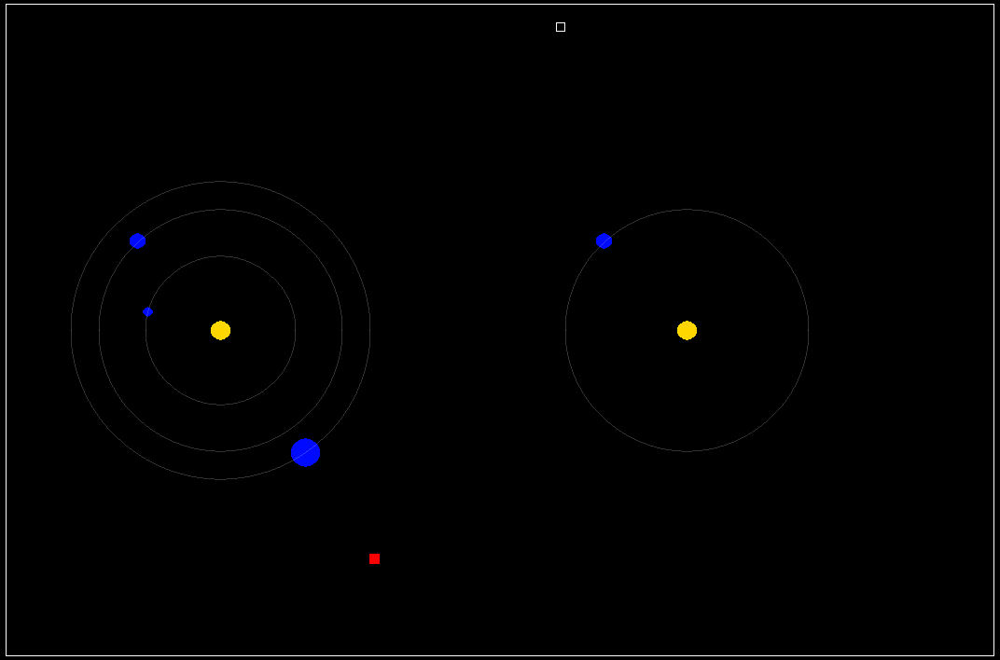

# Projet Coleil

> A 3D graphics and game development project built with C and SDL2


A space-themed game engine project developed as part of a 3rd-year engineering school curriculum. This project demonstrates game development fundamentals including physics simulation, graphics rendering, and event handling using SDL2.

## 🎮 Features

- Interactive space navigation system
- Real-time graphics rendering with SDL2_gfx
- Configuration-based game initialization
- Cross-platform support (Linux & Windows)
- C11 standard with modern CMake build system



## 📋 Prerequisites

- **CMake** 3.15 or higher
- **C Compiler**: GCC, Clang, or MSVC (Visual Studio)
- **SDL2** & **SDL2_gfx** libraries

### Installation by Platform

#### Ubuntu/Debian
```bash
sudo apt-get install cmake libsdl2-dev libsdl2-gfx-dev build-essential
```

#### Fedora/RHEL
```bash
sudo dnf install cmake SDL2-devel SDL2_gfx-devel gcc
```

#### macOS
```bash
brew install cmake sdl2 sdl2_gfx
```

#### Windows
- Install CMake from https://cmake.org/download/
- Install vcpkg for dependency management
- Install SDL2 and SDL2_gfx via vcpkg

## 🔨 Building

### Quick Build (Linux/macOS)
```bash
mkdir -p build
cd build
cmake -DCMAKE_BUILD_TYPE=Release ..
cmake --build . -j4
```

### Windows Build
```bash
mkdir build
cd build
cmake -DCMAKE_BUILD_TYPE=Release -DCMAKE_TOOLCHAIN_FILE="path/to/vcpkg/scripts/buildsystems/vcpkg.cmake" ..
cmake --build . --config Release
```

### Build Options
- `-DCMAKE_BUILD_TYPE=Release` - Optimized build for production
- `-DCMAKE_BUILD_TYPE=Debug` - Debug build with symbols

## 🚀 Running

### Default Configuration
```bash
./ProjetColeil
```

### With Custom Configuration File
```bash
./ProjetColeil /path/to/config.txt
```

The game will load the default configuration from `Assets/config.txt` if no argument is provided.

## 📁 Project Structure

```
.
├── src/                    # Source code
│   ├── main.c             # Entry point
│   ├── Model/             # Game logic
│   │   └── model.c        # Game model implementation
│   └── VueController/     # Rendering and input
│       └── vue_controller.c
├── include/               # Header files
│   ├── Model/
│   │   └── model.h
│   └── VueController/
│       └── vue_controller.h
├── Assets/                # Game assets
│   └── config.txt        # Game configuration
├── CMakeLists.txt        # CMake build configuration
└── README.md
```

## 🎛️ Configuration

The `Assets/config.txt` file defines the game world:

```
WIN_SIZE 1080 720          # Window dimensions
START 400 600              # Starting position
END 600 30                 # End position
NB_SOLAR_SYSTEM 2          # Number of solar systems
STAR_POS 240 360           # Star position
STAR_RADIUS 10             # Star radius
NB_PLANET 3                # Number of planets
PLANET_RADIUS 8            # Planet radius
PLANET_ORBIT -130          # Planet orbit radius
```

## 🔄 GitHub Actions CI/CD

This project includes automated workflows for:
- **Build Testing**: Automatic compilation on Linux and Windows
- **Release Creation**: Automated release packaging with platform-specific binaries

Releases are created automatically when tagging with `v*` (e.g., `v1.0.0`).

## 📦 Dependencies

- **SDL2**: Simple DirectMedia Layer library
- **SDL2_gfx**: SDL2 graphics primitives library
- **libm**: C math library (Linux/Unix)

## 🛠️ Development

### Compilation without CMake
```bash
gcc -Wall -O2 -o ProjetColeil src/main.c src/Model/model.c src/VueController/vue_controller.c -lm -lSDL2 -lSDL2_gfx
```

### Debugging
```bash
cmake -DCMAKE_BUILD_TYPE=Debug ..
make
gdb ./ProjetColeil
```

## 👨‍💻 Author

Developed as a team project for 3rd-year engineering students.

## 🐛 Troubleshooting

### SDL2 not found
```bash
# Linux: Install SDL2 dev packages
sudo apt-get install libsdl2-dev libsdl2-gfx-dev

# macOS:
brew install sdl2 sdl2_gfx

# Windows: Use vcpkg or download from https://www.libsdl.org/
```

### Build fails with "Permission denied"
```bash
chmod +x ProjetColeil
```

### Game won't start
Ensure `Assets/config.txt` exists and is properly formatted, or provide the correct path as argument.

## 📚 References

- [SDL2 Documentation](https://wiki.libsdl.org/)
- [CMake Tutorial](https://cmake.org/cmake/help/latest/guide/tutorial/index.html)
- [C11 Standard](https://en.wikipedia.org/wiki/C11_(C_standard_revision))
